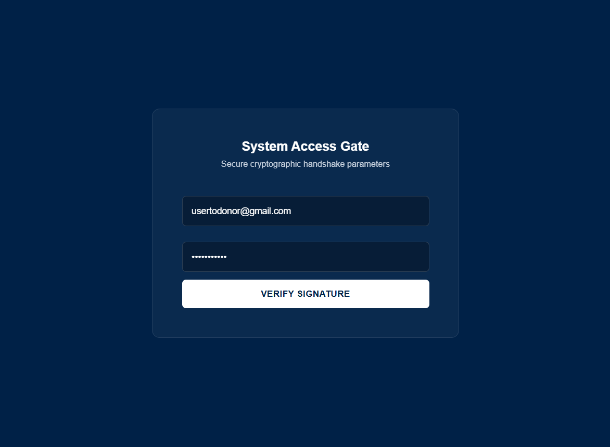
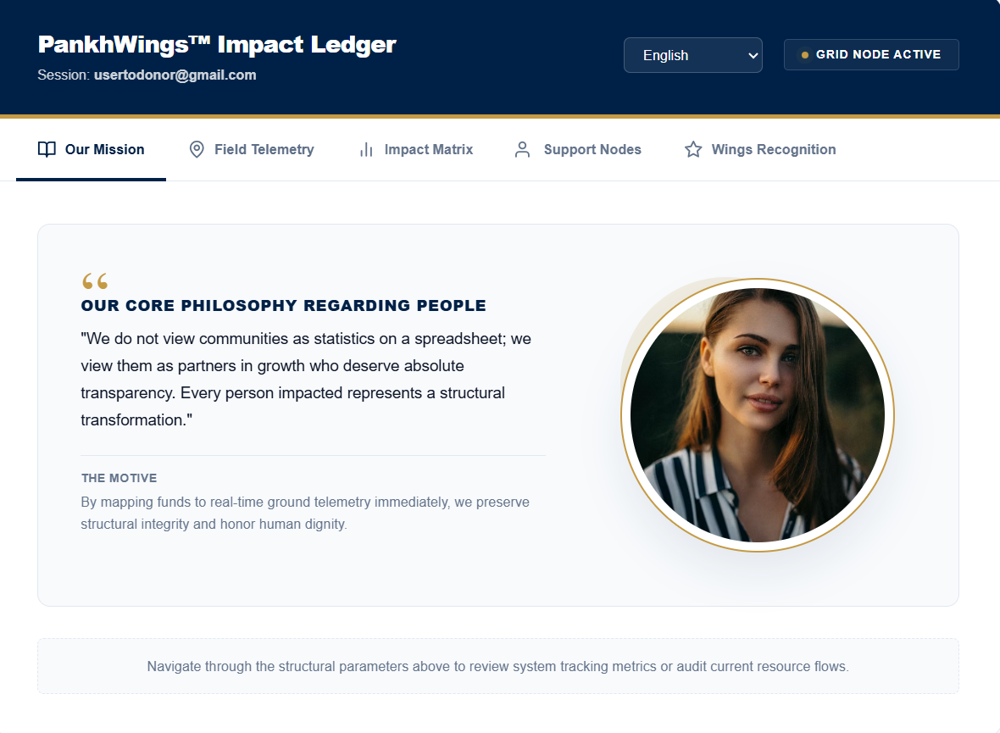
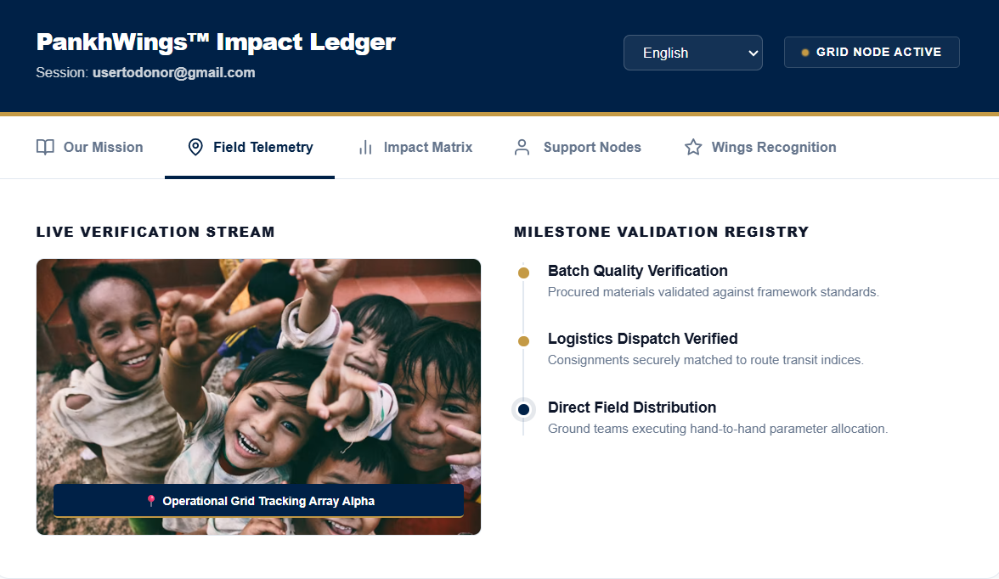
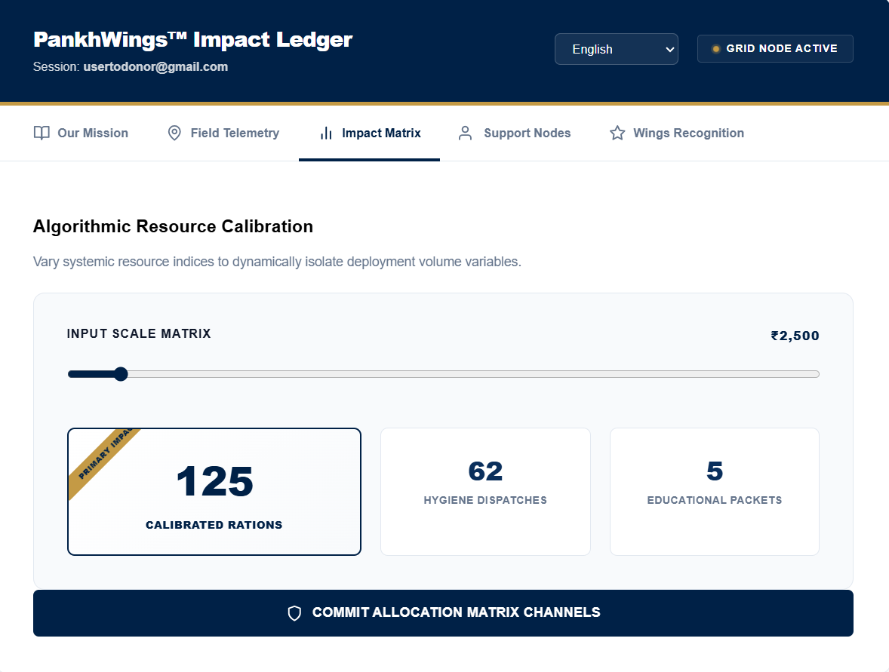
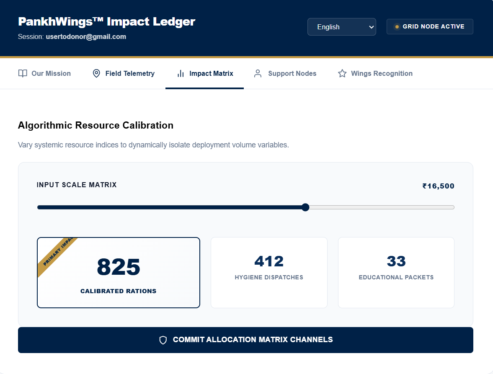
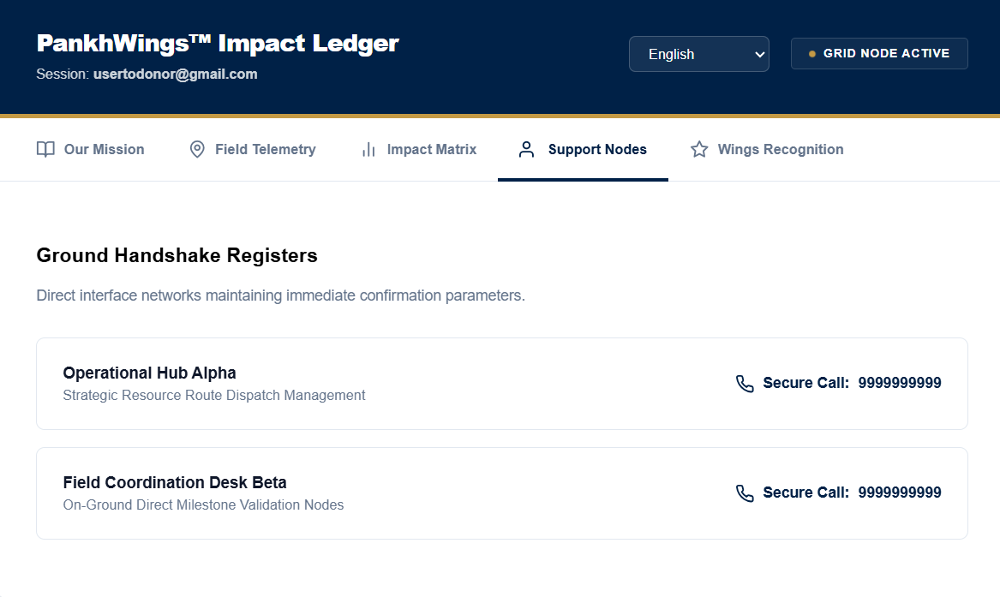
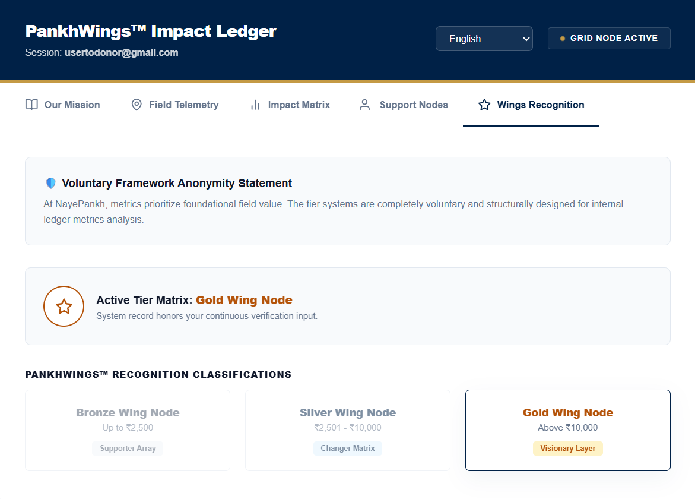
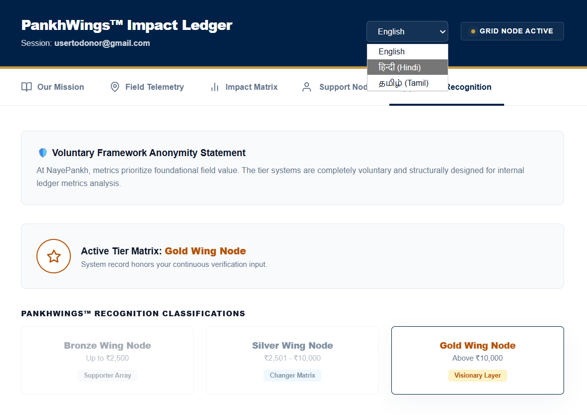
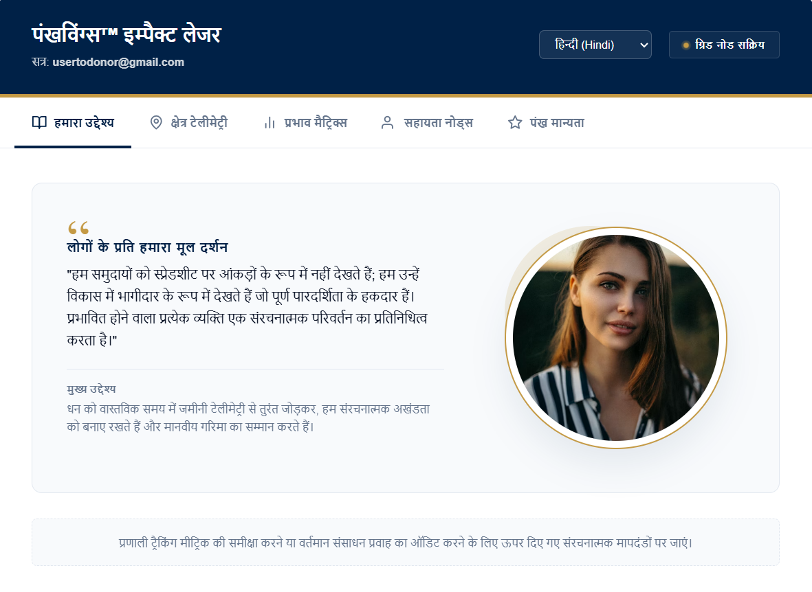
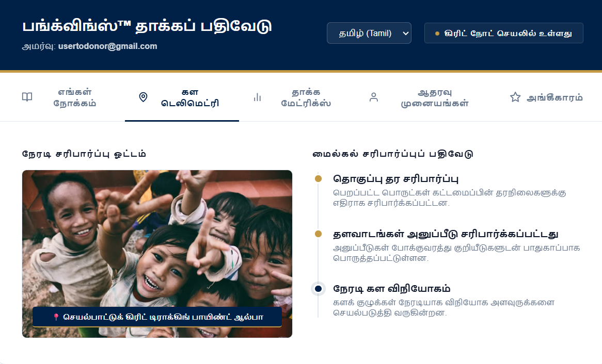

# NayePankh Dashboard: Making NGO Impact Visible
## Key Performance Indicators and System Metrics

### Operational Target Metrics
* **Resource Delivery Accuracy:** 98% target precision for computed nutrition and educational supply requirements.
* **UI Responsiveness:** Sub-100ms interface rendering time during project scale updates.
* **Localization Coverage:** 100% string translation across English, Hindi, and Tamil localized viewports.
* **Volunteer Conversion Target:** 25% projected increase in onboarding actions driven by interactive simulations.

### System Variables and Equations

The reactive engine calculates resource distribution based on the total number of target beneficiaries ($B$) and the project duration in days ($D$).

##### 1. Nutrition Deliverables ($N$)
Calculates the minimum required nutritional units using a fixed baseline multiplier ($M_n = 3.5$) to account for daily meals and supplemental vitamins.

$$N = B \times D \times M_n$$

##### 2. Educational Deliverables ($E$)
Determines educational kit requirements using a dynamic scaling factor ($S_e$) that adjusts downward as the project volume expands to account for bulk distribution efficiencies.

$$E = B \times S_e$$

$$\text{where } S_e = \begin{cases} 1.2, & \text{if } B < 500 \\ 1.0, & \text{if } B \ge 500 \end{cases}$$

### State Management Matrix
The dashboard updates state variables across distinct localization domains ($L$) and scale vectors ($V$) according to the following relational matrix:

$$
\mathbf{M}_{\text{state}} = 
\begin{pmatrix} 
L_{\text{en}} & V_{\text{nutrition}} \\ 
L_{\text{hi}} & V_{\text{education}} \\ 
L_{\text{ta}} & V_{\text{logistics}} 
\end{pmatrix}
$$

### Sneak Peak
A visual walkthrough of the NayePankh Dashboard interface, demonstrating the reactive UI and data-scaling capabilities.

| 1 | 2 | 3 | 4 | 5 |
| :---: | :---: | :---: | :---: | :---: |
  |  |  |  |  | 
| **6** | **7** | **8** | **9** | **10** |
|  |  |  |  |  |

> **Project Video:**
<video src= "https://github.com/user-attachments/assets/2e70824b-40c5-4cb7-868c-5ef965dfac88" width="100%" controls></video>

### Developer Profile

 **Harini Palani**  
 *B.E. Computer Science Engineering (AI & ML) | HP Life Ambassador | GSSoC Ambassador*  

* **Email:** [harinishiv2304@gmail.com](mailto:harinishiv2304@gmail.com)
* **LinkedIn:** [linkedin.com/in/harini-palani-computer-science-engineering-aiml](linkedin.com/in/harini-palani-computer-science-engineering-aiml)
---
